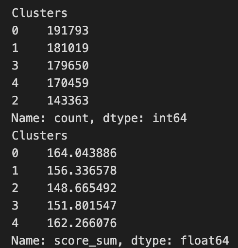
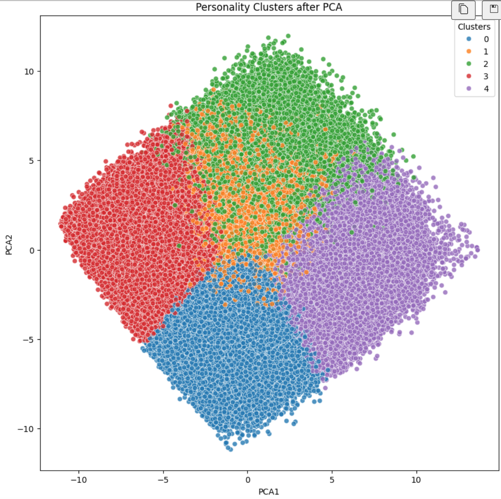

# 项目报告

## 一、对关键的分析过程或结果的模式，进行直观可视化展示。项目背景描述（基于什么领域，解决什么样的问题）

本项任务旨在探讨大五人格个性心理特征，与自尊、生活满意度、主观幸福感、身体健康等生存发展适应性指标之间的历史-社会生态因素动态关联性。任务主要基于心理学（大五人格理论）与社会学（宏观社会生态因素，如经济、政治、文化、人口等宏观社会结构）领域，并探讨宏观社会生态环境因素对大五人格特质的影响问题。

其中，大五人格理论是当今心理学中最广为人知和应用的个性特质理论之一。该理论认为，人格可以被归纳为五个基本维度:

    外向性(Extraversion)
        反映个体在社交、活跃度、积极情绪等方面的特点
        高外向性者通常更社交、乐观、主动
        低外向性者则更内向、冷淡、安静

    宜人性(Agreeableness)
        反映个体在友善、同情、合作等方面的特点
        高宜人性者更友善、信任、合作
        低宜人性者则更自我中心、对抗、独立

    尽责性(Conscientiousness)
        反映个体在有条理、自律、负责等方面的特点
        高尽责性者更勤勉、有条理、可靠
        低尽责性者则更随意、无序、缺乏自律

    神经质(Neuroticism)
        反映个体在情绪稳定、压力应对等方面的特点
        高神经质者更易焦虑、易怒、情绪化
        低神经质者则更平稳、冷静、自信

    开放性(Openness to Experience)
        反映个体在创造力、想象力、好奇心等方面的特点
        高开放性者更富有创造力、喜欢新事物
        低开放性者则更保守、常规

## 二、问题定义（明确定义解决问题，说明前提假设和问题是否/如何简化）

问题定义为，宏观的社会生态因素对大五人格特质是否有影响，以及会产生怎样的影响。

需要完成的目标有：

- 提供基于传统心理测量法或大数据分析所得关键研究指标的信效度信息。
- 收集和整理典型的历史-社会生态宏观指标数据，并对其进行必要的降维简化处理。
- 对特定的亲和-匹配适应性模式进行较深入分析，并做出归纳总结。
- 对关键的分析过程或结果的模式，进行直观可视化展示。

## 三、实现系统架构/算法框架描述（技术方案，算法流程描述。对关键部分给出示意图、伪代码或公式补充理论依据）

我们将解决方案分为以下几个步骤：

### 1. 寻找数据集

由于宏观社会生态因素涉及方面过多，本次任务将这方面聚焦于包括宏观/微观的经济（收入、就业）、环境（社区、教育、生态环境、安全）、健康（生活满意度、健康状况）三个方面。

对于人格特质方面，我们将选择五个国家（美国、加拿大、澳大利亚、印度、英国）的大五人格数据集，同时寻找相应国家的社会生态因素数据集。

### 2. 初步分析

找到数据集后，进行数据清洗（传统的去空，去重，异常值检测）和降维处理，将数据集中的数据进行标准化处理。

同时需要将大人格数据集与社会因素数据集进行两表连接，进行数据的初步分析，包括关键指标的信效度信息分析，聚类分析。

### 3. 可视化分析

将经过处理的数据作为数据源制作可视化图表大屏，分析寻找社会生态因素对大五人格特质的影响关系并进行直观展示。

## 四、实验设置（详述数据集、评价指标、实现细节、参数设置等）

以下是详细的实验过程：

### 1. 数据集

详细的数据集描述信息参见`data/README.md`，包括寻找到的两个原始数据集（人格数据集、社会因素数据集），以及实验过程中的产出数据集。

### 2. 初步分析

#### 数据处理，代码详见src/country_select.py,new_output_example.py

原有人格数据集有很多单个的国家数据，没有具体分析意义。country_select.py筛选出人格数据集中数量最多的五个国家进行人格数据分析。
对两个人格与地域数据集进行分割连接，具体以Canada为例见new_output_example.py。由于国家数据集和人格数据集的国家表示格式不同只能用手动连接

#### pca降维处理，代码详见src/pca.py

将处理连接后的数据集进行pca降维处理后可视化展示

#### 因子分析，代码详见src/relief.py

对数据进行因子分析聚类，得出经度（也就相当于国家）在总体人格数据集上起到最大的影响作用

#### 克隆巴赫系数，代码详见src/relief.py

克隆巴赫系数体现了数据内部信度一致性。

#### 聚类分析，代码详见src/k-means.ipynb文件。

对原始人格数据集进行数据清洗后挑选出数据集中50列和人格相关的数据集，在该数据基础上构建k-means模型将所有数据分为5类。该模型同时能够输入个人的人格数据对人格进行预测。
之后对五个人格维度分别聚合显示五类人格类型分布并可视化每个cluster中五个人格维度数据的表现。
使用人格相关的数据构建二维PCA模型并可视化聚类结果。

#### 人格-全球类数据集，代码详见src/connect.py文件。

对以'output\_'前缀的五个国家数据集进行数据清洗和整理，去除实验无关指标，其他指标以整体平均值为准。

### 3. 可视化分析

在可视化分析中，我们选用[DataEase](https://dataease.io)作为可视化分析工具。首先租用一台云主机（ucloud），然后按照官网示例将其部署为一个网页应用，之后便可通过网页来进行数据图表制作。

最终完成的可视化大屏如下：

## 五、结果分析（通过表格、图像等直观展示。客观分析结果，解释现象）

### 1. 初步分析结果

- 通过pca降维分类画图之后可以看出不同国家总体人格倾向的聚集性，其中点的距离越近代表人格特质越相似：

  

- 通过因子分析进行绘图之后，通过碎石图我们可以得出不同特征对最终人格倾向的影响程度，其中影响最大的为经纬度特性，实际为各个国家间的社会因素不同造成的影响

  

- 在数据一致性检验方面，通过克隆巴赫系数可以看出总体人格数据的可信度是在接受范围内：

  Cronbach's α: (0.39020902937607754, array([-0.799, 0.927]))

- 通过k-means聚合出的cluster分布如下，可以看出五类人格之间数量相差，以及分数相关指标，分数越低的cluster数量越少：

  

- 每个cluster中五个人格维度的分数分布如下，可以从中看出cluster类别偏向指标，如cluster1类型明显看出CSN尽责性表现较低。

  

- 五个cluster的集群可视化结果：

  

### 2. 可视化分析结果

## 六、团队成员贡献（组内成员简单说明自己做了什么即可）

- 刘露莹：人格数据集聚类和可视化，五个国家人格和相关指标数据合并。
- 朱施颐：人格数据降维，特征分析，数据处理/分割/去重/，数据一致性检验。
- 朱文韬：文档组织与编写，可视化图表制作与结论分析，PPT制作与答辩。
